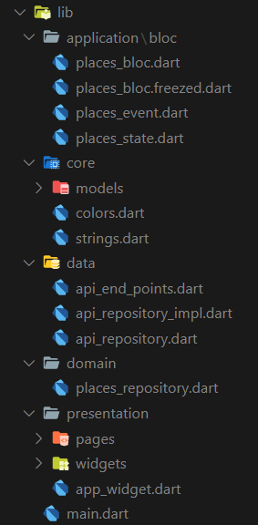

[](https://github.com/Shadow60539/travel_app)              

# Introduction

> “Airnbn”
is a small, simple and beautiful app which lists destinations.

Before we start, you can take a look at the app:


## Key Features

- [x] Book trips with a single swipe.
- [x] View trips timeline.
- [x] Favourite any trip.


## How To Use

To clone and run this application, you'll need [Git](https://git-scm.com) and [Flutter](https://flutter.dev/docs/get-started/install) installed on your computer. From your command line:

```bash
# Clone this repository
$ git clone https://github.com/Shadow60539/travel_app.git

# Go into the repository
$ cd travel_app.git

# Install dependencies
$ flutter packages get

# Run the app
$ flutter run
```


### Packages


Some very good packages are used in the project, not a big list.


Below are the information about these packages.


package | explain
---|---
[font_awesome_flutter](https://pub.flutter-io.cn/packages/font_awesome_flutter) | Awesome icons
[flag](https://pub.flutter-io.cn/packages/flag) | Country Flags
[http](https://pub.flutter-io.cn/packages/table_calendar) | Network
[cached_network_image](https://pub.flutter-io.cn/packages/cached_network_image) | Caching Network Images
[flutter_bloc](https://pub.flutter-io.cn/packages/flutter_bloc) | Bloc Pattern
[lottie](https://pub.flutter-io.cn/packages/lottie) | Lottie files animations
[google_fonts](https://pub.flutter-io.cn/packages/google_fonts) | Google fonts 
[freezed](https://pub.flutter-io.cn/packages/freezed) | Code generation for immutable classes
[lint](https://pub.flutter-io.cn/packages/lint) | Rules handler for Dart
[build_runner](https://pub.flutter-io.cn/packages/build_runner) | Build Custom Models

### Directory Structure

The project directory structure is as follows:

```
├── android
├── asset
├── build
├── images
├── ios
├── lib
├── pubspec.lock
├── pubspec.yaml

```


Let me explain the other directories besides **lib**:

directory | explain
---|---
images | readme images files
asset | images and lottie files

Then the lib directory





directory | explain
---|---
core | Global Classes
data | Fetching data from backend
domain | Converting raw json data into models -DTOs
application | State Management 
presentation | UI

